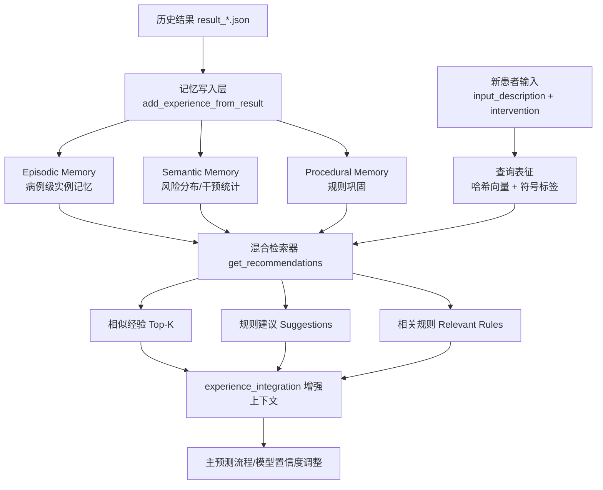

# 前沿混合记忆经验知识库技术路线（科研风格）

## 1. 研究目标与问题定义

在脓毒症 SOFA 评分预测任务中，纯参数化大模型在跨病例泛化时存在两类关键瓶颈：

1. **时序经验难以累积**：历史预测-评估结果无法被稳定沉淀为可复用知识；
2. **推理可控性有限**：仅依赖语义相似检索易忽视干预策略与风险标签等符号约束。

本工作构建 `AdvancedExperienceMemoryBank`，目标是在不破坏现有系统流程的前提下，通过**分层记忆 + 混合检索 + 在线巩固**机制，提升后续病例预测的一致性、稳健性与可解释性。

---

## 2. 方法总览（Technical Roadmap）

---

## 3. 核心技术模块

### 3.1 Episodic Memory（情景记忆）

系统以病例为最小记忆单元，保存：`patient_id`、干预文本、风险等级、置信度、质量分、时间戳、embedding 与标签。该层主要回答“**历史上是否出现过相似病例**”。

- 数据结构：`EpisodicMemory`。
- 写入入口：`add_experience_from_result`。
- 基础语义表示：`_hash_embedding`（无外部依赖哈希向量）。

### 3.2 Semantic Memory（语义统计记忆）

对全部病例做分布性汇总，维护：

- `risk_distribution`：风险等级频次；
- `intervention_effectiveness`：干预类型的样本量与平均质量。

该层主要回答“**群体层面上，哪些干预在何种风险背景下更可靠**”。

### 3.3 Procedural Memory（程序规则记忆）

系统以“干预类型 + 风险等级”为键聚合高质量案例，并触发规则巩固：仅保留支持度足够且平均质量达标的模式，形成可执行建议。该层主要回答“**在当前风险与干预场景下，应优先遵循哪些经验策略**”。

---

## 4. 混合检索与评分机制

对每个候选历史记忆，定义综合得分：

\[
S = 0.45\cdot S_{dense} + 0.35\cdot S_{symbolic} + 0.15\cdot S_{quality} + 0.05\cdot S_{recency}
\]

其中：

- \(S_{dense}\)：查询向量与病例向量余弦相似度；
- \(S_{symbolic}\)：干预类型/风险标签匹配分；
- \(S_{quality}\)：案例质量（由历史置信度映射）；
- \(S_{recency}\)：指数时间衰减，强调近期经验。

该设计的理论动机是：

1. 语义相似保证病例内容可比性；
2. 符号约束抑制“语义近但临床策略不一致”的误召回；
3. 质量与时效项提升记忆可用性与动态适配能力。

---

## 5. 与现有系统的集成方式

在 `ExperienceIntegration` 初始化阶段，系统采用“**前沿经验库优先，旧版经验库回退**”策略：

1. 若 `AdvancedExperienceMemoryBank` 可用，优先实例化并加载；
2. 若新模块异常或不可用，自动回退 `ExperienceKnowledgeBase`。

因此，现有预测主流程无需修改调用协议，即可获得新的记忆增强能力，保证可部署性与兼容性。

---

## 6. 运行流程（面向实验复现）

1. **离线积累**：从 `output/best_result/result_*.json` 批量导入历史结果；
2. **在线推理前**：输入当前病例文本与干预信息；
3. **在线检索**：返回 Top-K 相似经验、规则建议、相关规则；
4. **上下文增强**：将经验信号注入预测上下文与置信度调整环节；
5. **闭环更新**：新预测完成后再次写回经验库，形成持续学习闭环。

---

## 7. 学术风格讨论：优势与局限

### 7.1 预期优势

- **可解释性增强**：输出含相似案例与规则来源，便于医学审阅；
- **持续演化能力**：新病例将自动更新统计与规则；
- **工程友好性**：无额外向量数据库依赖，轻量部署。

### 7.2 当前局限

- 哈希向量表达能力弱于专用医学 embedding 模型；
- 规则巩固仍是启发式阈值策略，尚未引入因果校正；
- 风险标签提取依赖上游结果质量，存在误差传播。

### 7.3 后续研究方向

- 引入临床语料微调的医学嵌入模型与 ANN 索引；
- 结合反事实评估（counterfactual）优化规则置信度；
- 构建“记忆写入门控网络”，学习何时写入/遗忘。

---

## 8. 结论

该经验知识库实现以“**实例记忆 + 统计记忆 + 规则记忆**”为核心，形成了从历史结果沉淀到在线检索增强再到闭环更新的完整技术路径。其设计兼顾学术合理性与工程可落地性，可作为后续高阶记忆增强（如因果记忆、元学习记忆）的基础框架。
